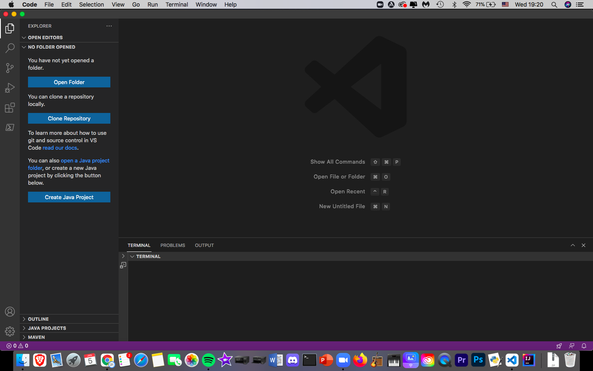
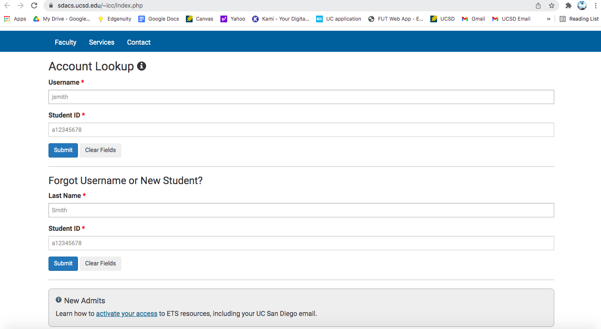
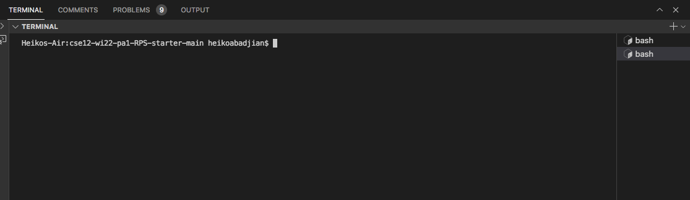
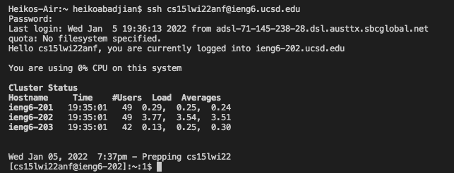
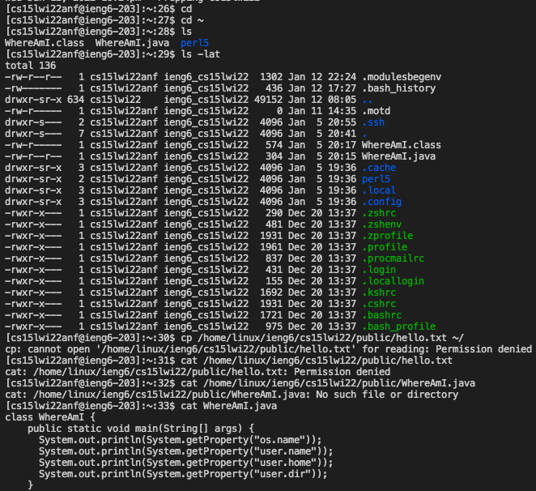
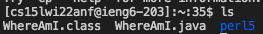
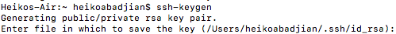
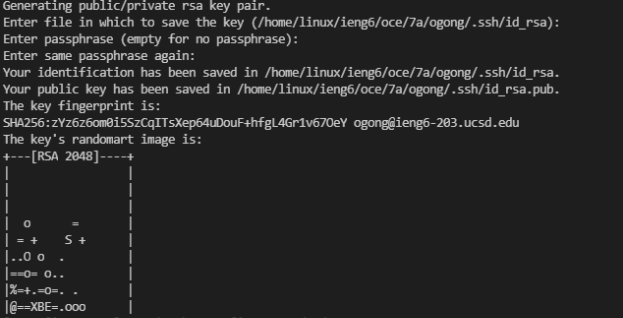
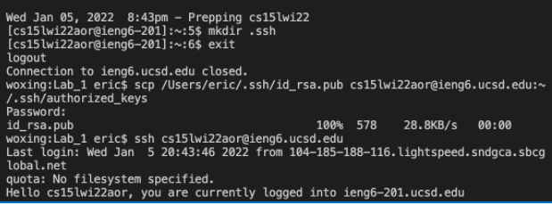
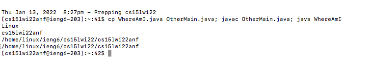

# Remote Access

## Step 1: Installing VSCode
I already had VSCode installed on my computer✅


---

## Step 2: Remotely Connecting

* First, get your account info by visiting **[this](https://sdacs.ucsd.edu/~icc/index.php)** website


* Next, open Visual Studio Code and open the terminal by pressing (Ctrl or Command + `) or by clicking the terminal icon at the top then **"New Terminal"**.
Here is an example:


* Once your terminal is open, type in this command ```ssh cs15lwi22zz@ieng6.ucsd.edu```. Remember to replace "zz" with your specific username. If it's your first time logging in, you'll see a quesion asking you if you want to connect. Answer "yes" and you're good to go. After answering "yes", enter your password(don't worry if nothing shows up) and you should see this: 


* Great job! You are now connected to one of the computers in the CSE basement. 


***

## Step 3: Running Commands

* Some basic commands everyone should know when using a terminal are:
1. **ls** - lists everything in the current directory
2. **cd** - changes directory to home if nothing is typed afterwards(same as cd ~)
3. **ls -lat** - lists everything in long format, lists hidden directories, and lists the time of the last edit 
4. **cp** copies files to another place (must have permission to read the file)
5. **cat** - prints the files contents to the terminal
6. **mv** - moves file from current directory to another


***
## Step 4:
For this step we will be using the "**scp**" command, which allows us to copy files back and forth between the client and the server.
* First, get the name of the file you want to copy onto the server and type in this command **while in ssh**: ```scp **File Name** cs15lwi22zz@ieng6.ucsd.edu:~/```
* Next, enter your password and use the command **ls**. You should see the file you copied over in the list of directories.



***
## Step 5: Setting an SSH Key

* An ssh key is a tool which allows you to ssh without having to enter the password every time you want to log in. We can do this by typing in this command ```ssh-keygen``` on the client.

* It will ask you for a file to save the key. Copy and past the directory in the parentheses and hit enter. Then leave the passphrase empty.
* You should see something like this:
  

* Once this is done, ssh using your username, log in by entering your passsword, then type in the comand ```mkdir .ssh``` on the server then logout.
* Once back on the client, enter this command: ```scp /Users/user/.ssh/id_rsa.pub cs15lwi22@ieng6.ucsd.edu:~/.ssh/authorized_keys``` Be sure to replace the user with your own as well as the account username you are "sshing" into. 
  



***
## Step 6: Optimizing Remote Running
* In order to save some time, you can type commands like ls on the same line that you are sshing. It looks something like this:
```cp WhereAmI.java OtherMain.java; javac OtherMain.java; java WhereAmI```
  



