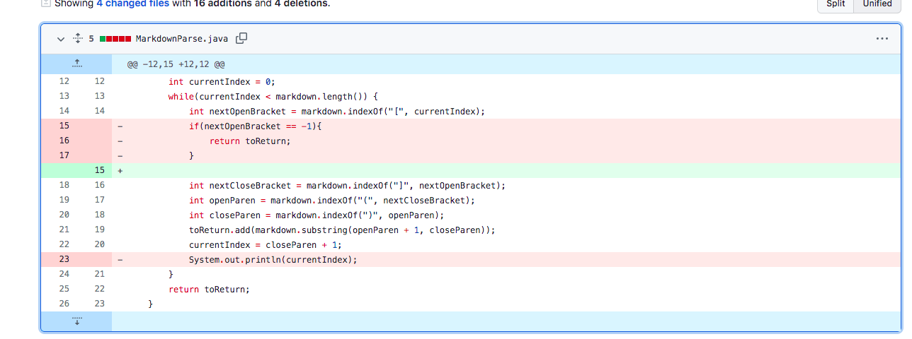
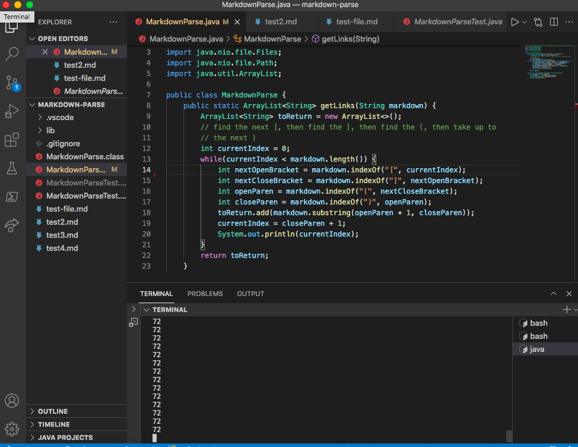
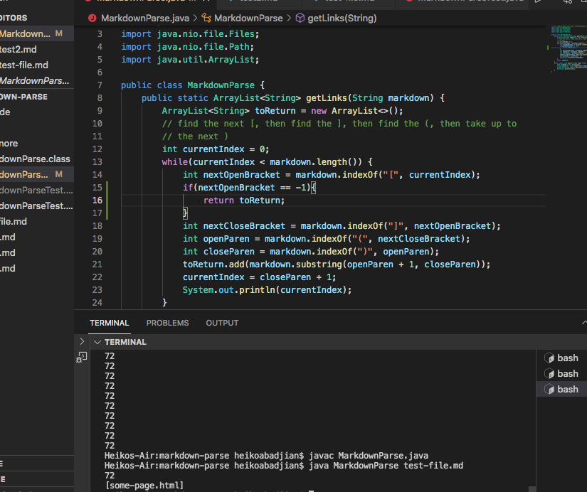
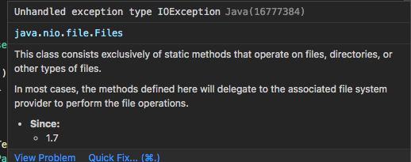
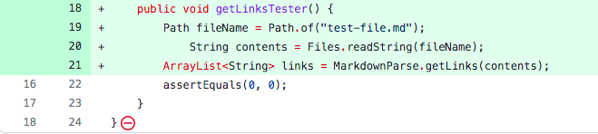
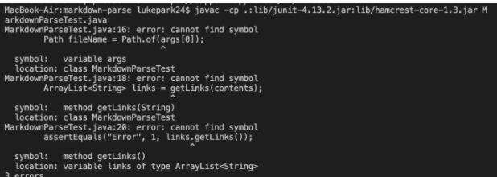
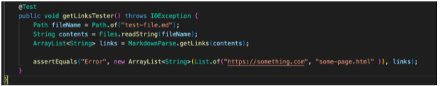

# Week 4 Lab Report: Syptoms and Bugs

## Code Change #1:

* The first problem we encountered was an infinite loop. A link to the failing test can be found **[here](https://github.com/habadjian/markdown-parse/blob/main/test-file.md)**.
  


* The infinite loop looked like this:
  


* The way we fixed it was by adding an ```if``` statement that checked if ```nextOpenBracket``` was equal to -1. If it was, it would return ```toReturn```.
  


* The bug in our program was apparent because we didn't have the ```if``` statement that checked if the index was -1. The symprtom was the infinite loop in this case and the failure inducing output was not having a closed bracked in **test-file.md**.

***

## Code Change #2:

* Our second problem was with the tester file for the week 4 Lab. When we tried to read the file contents in the tester file, we would get this error message(Link **[here](https://github.com/habadjian/markdown-parse/blob/main/MarkdownParseTest.java)**):
  

  


* Error Message:
  

  
* We were able to fix this by adding ```throws IO Exception``` after the parenthesis in the method header.

* Here is an image of the fixed file:
  


* The bug here was caused by not having the ```throws IO Exception``` in the method header. The symptom was the code not being able to compile due to the Exception not being able to be thrown. 

***

# Coding Change #3:

*

