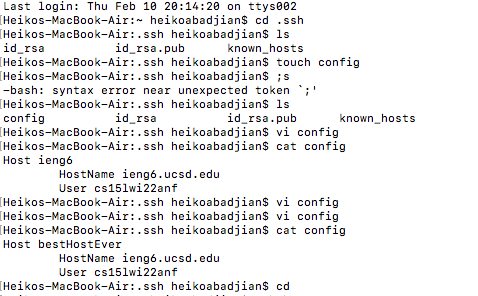
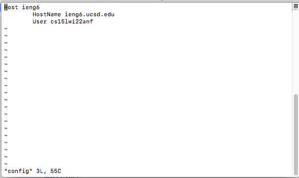
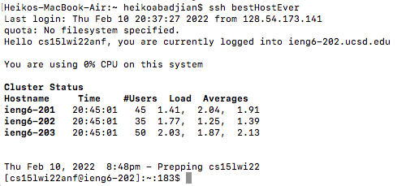
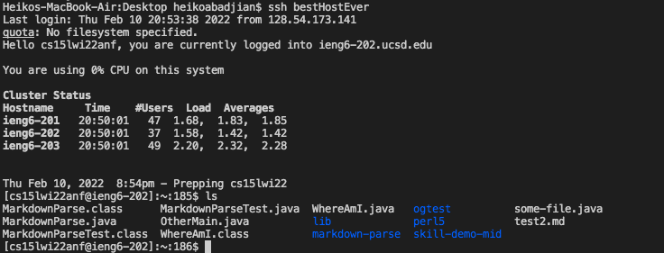

# Week 6 Lab Report: Streamlining ssh Configuration
  
***
  
## Creating ```.ssh/config``` file:

* The first step for this lab was to create a config file in the .ssh directory. I did this using the command line argument ```touch config``` while in the ".ssh" directory to create a file called config.
  

  
* Once I created the file using ```touch```, I used the command line arguemtn ```vi``` to edit the config file. I then added the required lines into the config file via the terminal.I then saved the edited file with the command ```:w``` and then quit the editor with ```:q```. Once this was done my config file had been edited and was ready to go.
  


***

## Logging in with new alias
  
* After my config file was ready to go, I edited my alias to "bestHostEver" and logged into the server:
  


***
  
## SCP with new alias
  
* Once my new ssh alias had been setup, I made sure my copying a file onto the server using ```scp```.
  
* I created an empty file called "some-file.java" and I copied it over to the ssh server using this line in the terminal: ```scp some-file.java bestHostEver:~/```.
  

  
  

***
  


