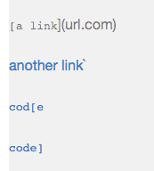

# Week 8 Lab Report: Debuggers

**Repositories used for this lab**

* [Link to my Repo](https://github.com/habadjian/markdown-parse)
  
* [Link to the reviewed Repo](https://github.com/mramada22/markdown-parse)

***

## Snippet 1:

* What should be produced:


  
* Test used for both my repo and reviewed repo: 
  


* My snippet 1 test output(failed):
  


* Reviewed repo Snippet 1 test output(failed):
  


* Code change answer: I believe there is a small code change that could be implemented in order to read ``` `[a.com`](url.com) ``` as a link. There could be an ```if``` statement implemented that would check for a the "``` ` ```" character before the ```nextOpenBracket``` variable. If there was a chracter, then disregard it and move on with the loop.
***
  
## Snippet 2:

* What should be produced:


  
* Test used for both my repo and reviewed repo: 
  


* My snippet 2 test passed✅

* Reviewed repo Snippet 1 test output(failed):
  


* Code change answer: 
Although my snippet 2 tester passed, there are still ways to improve the code. For tests with multiple parenthesis, it would be best to find the last closed parenthesis and updated the index of ```closeParen``` to that index.
***
  
## Snippet 3:

* What should be produced:
  

    
* Test used for both my repo and reviewed repo: 
    

   
* My snippet 3 test output(failed):
    

    
* Reviewed repo Snippet 1 test output(failed):
   


* Code change answer: I believe that there is a small code change I could make that could read links with new lines. I could add an ```if``` statement that could check if there was a new line(using ```\n```) after ```nextCloseBracket``` or ```openParen```. 