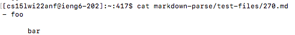
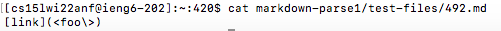

# Week 10 Lab Report: Different Bugs

## How I found tests with different results:
  
* I first ran the tests for both [my own markdown-parse](https://github.com/habadjian/markdown-parse/blob/main/MarkdownParse.java) and the [one linked in this lab](https://github.com/ucsd-cse15l-w22/markdown-parse/blob/main/MarkdownParse.java).
  
* I then copied the results from unning those texts to a file called results.txt.
  
* I then ran this command to find the difference between the results of both markdown-parse files: ```diff markdown-parse/results.txt markdown-parse1/results.txt```
  


## **Bug 1**
* The first test I am going to use is the test called "270.md". 
  
* This tests contents are:
  


* The results I got from running diff are:


* The implementation I think is correct is the one linked in this lab(Joe's) because the contents of the file are not a link but my own implementation read it as a link. The expected output is ```[]```. My output was wrong because it read the title as a link when it shouldn't have.
  
* The bug here is the code read the indents and the new line as a link when it should not have. I can have a check in the code around line twenty that checks for ```/n```(new lines) in the link and if there is one I can not count that as a link.
  
* My markdown parse for reference:


  
## **Bug 2**
  
* The second test I am going to use is called "492.md".
  
* This tests contents are:



* The results I got from running diff are:
  


* The implementation I think is correct is the one linked in this lab(Joe's) because the contents of this file are also not a link becasue you can't have the characters "<" or ">" in a link. The expected output is ```[]```. 

* The problem with my code is that there is no statement or conditional to check if the link in the parenthesis was valid. Something I could do to fix this is to check if there are any invalid characters between the ```openParen``` or ```closeParen```. I could add an if statement after line 20 that checks if there were any invalid characters between the parentheses.

* My markdown parse for reference:
  
